# Memoria técnica · KelseTS Talks

## Datos del proyecto

| Dato | Información |
| --- | --- |
| Proyecto | Aplicación de gestión de eventos y asistentes |
| Módulo | Del desarrollo del servidor al diseño de interfaces web |
| Formación | Máster Rock The Code · The Power Tech School |
| Autora | Araceli Fradejas Muñoz |
| Tecnologías principales | JavaScript, Node.js, Express, React y MongoDB |
| Web | [KelseTS Talks](https://kelse-ts-talks.vercel.app/) |
| API | [Comprobación de disponibilidad](https://kelse-ts-talks-api.vercel.app/api/health) |
| Repositorio | [RTC-PROYECTO10-FULL-STACK-JAVASCRIPT](https://github.com/AraceliFradejas/RTC-PROYECTO10-FULL-STACK-JAVASCRIPT) |
| Código de la interfaz | [frontend](frontend) |
| Código del servidor | [backend](backend) |
| Evidencias de desarrollo y entrega | 13 y 19 de septiembre de 2026 |

> Esta memoria recoge el desarrollo real del proyecto. Las cifras se vinculan a las comprobaciones documentadas y las imágenes son capturas reales de la aplicación y de las herramientas utilizadas. Las pruebas locales, las integraciones con MongoDB Atlas y las comprobaciones manuales en producción se identifican por separado.

## 1. Contexto y motivación

Este proyecto continúa mi aprendizaje con Node.js, MongoDB y las API REST. En el proyecto anterior trabajé con la extracción de un catálogo de libros y su persistencia. En este trabajo he conectado una API con una interfaz completa para que una persona pueda registrarse, descubrir una charla, reservar una plaza y gestionar sus propios eventos desde el navegador.

He situado la aplicación dentro de KelseTS, una marca ficticia que une deporte, cultura, tecnología y formación. Su origen está en mi interés por el universo de Taylor Swift y en la idea de transformar una ilusión personal en una identidad creativa para mis proyectos del máster. KelseTS Talks amplía las propuestas anteriores de KelseTS Lifestyle, KelseTS Store y KelseTS Business School.

Las charlas tratan liderazgo, resiliencia, rendimiento, innovación, bienestar y trabajo en equipo. La idea de avanzar paso a paso y del esfuerzo colectivo también toma inspiración temática de la película *Un domingo cualquiera*, sin reproducir su guion ni utilizar imágenes de la película.

Los ponentes, encuentros y testimonios son ficticios. Los recursos gráficos y audiovisuales son recreaciones del proyecto, con su procedencia documentada en [Recursos y atribuciones](docs/RECURSOS.md). La web incluye un aviso educativo y de ausencia de afiliación con las personas y entidades que sirven de inspiración cultural.

## 2. Objetivos

Mi objetivo principal ha sido desarrollar una aplicación que permita:

- registrarse e iniciar sesión automáticamente después del alta;
- acceder con correo y contraseña y mantener la sesión al recargar;
- consultar, buscar, filtrar y ordenar una agenda pública;
- abrir el detalle de una charla y consultar sus asistentes;
- crear y editar eventos propios con un cartel;
- subir las imágenes a Cloudinary;
- reservar y cancelar una plaza con control de aforo;
- relacionar los usuarios y los eventos en MongoDB;
- proteger las operaciones privadas mediante autenticación y permisos;
- comunicar los estados de carga, los errores y las confirmaciones;
- desplegar la interfaz y la API para utilizar la aplicación fuera del entorno local.

Como objetivos de calidad me propuse separar responsabilidades, reutilizar componentes y peticiones, validar las entradas en cliente y servidor y acompañar la entrega de pruebas y evidencias. Como ampliaciones incorporé recuperación de contraseña, correos de asistencia y una interfaz con selector de idioma.

## 3. Requisitos y cumplimiento

| Requisito | Implementación | Estado |
| --- | --- | :---: |
| Servidor con Express y MongoDB | Aplicación Express y modelos Mongoose | Cumplido |
| Usuario con nombre, correo y contraseña protegida | Modelo `User` y resumen criptográfico con bcrypt | Cumplido |
| Autenticación y rutas protegidas | JWT y comprobación de usuario y versión de sesión | Cumplido |
| Eventos con asistentes referenciados | Modelo `Event` con referencias a `User` | Cumplido |
| Registro con acceso automático | La respuesta de registro establece la sesión | Cumplido |
| Listado y ordenación | Agenda por fecha, publicación o popularidad | Cumplido |
| Creación autenticada de eventos | Formulario protegido y validación en la API | Cumplido |
| Detalle y lista de asistentes | Ficha con cartel, ponente, aforo y participantes | Cumplido |
| Confirmación de asistencia | Relación en ambas colecciones mediante transacción | Cumplido |
| Subida de archivos | Multer y Cloudinary para los carteles | Cumplido |
| Gestión de errores y carga | Mensajes, validación y estados de operación | Cumplido |
| Componentes y lógica reutilizables | Campos, tarjetas, contextos y funciones compartidas | Cumplido |
| Peticiones centralizadas | `apiRequest` en `frontend/src/services/api.js` | Cumplido |
| Publicación de ambas aplicaciones | Dos proyectos independientes en Vercel | Cumplido |

La [comprobación del enunciado](docs/COMPROBACION-ENUNCIADO.md) desarrolla esta correspondencia. La API también permite eliminar eventos y actualizar el avatar; esas operaciones no tienen una pantalla de gestión en la web. La subida exigida se demuestra mediante los carteles.

## 4. Tecnologías

### Node.js y Express

He utilizado Node.js 20 o posterior y módulos de JavaScript con `import` y `export`. Express organiza las rutas, recibe las peticiones y devuelve respuestas JSON. Nodemon reinicia el servidor durante el desarrollo.

### MongoDB Atlas y Mongoose

MongoDB Atlas almacena usuarios y eventos. Mongoose define los modelos, valida su estructura y permite trabajar con referencias y transacciones para mantener coherentes las reservas.

### React, React Router y Vite

React compone las pantallas con componentes reutilizables. React Router gestiona la navegación y Vite prepara el entorno de desarrollo y la compilación. Los estilos se organizan en archivos CSS de base, componentes, tema y accesibilidad.

### Autenticación y archivos

JWT identifica la sesión y bcrypt protege las contraseñas. CORS configura los orígenes admitidos. Multer recibe imágenes y Cloudinary conserva los archivos subidos fuera del sistema de archivos del servidor.

### Correo, pruebas y despliegue

Nodemailer prepara el envío de correos y Mailtrap Sandbox permite inspeccionarlos en un entorno de pruebas. Utilizo `node:test` en el servidor, Vitest en la interfaz e Insomnia para comprobar peticiones HTTP. Vercel aloja las dos aplicaciones. Las versiones de las dependencias quedan registradas en los archivos de bloqueo del repositorio.

## 5. Arquitectura

```text
backend/
├── src/
│   ├── config/
│   ├── controllers/
│   ├── data/
│   ├── emails/
│   ├── middlewares/
│   ├── models/
│   ├── routes/
│   ├── services/
│   ├── utils/
│   ├── app.js
│   └── server.js
└── test/
frontend/
├── public/
├── scripts/
└── src/
    ├── components/
    ├── context/
    ├── data/
    ├── hooks/
    ├── i18n/
    ├── pages/
    ├── services/
    ├── seo/
    └── styles/
docs/
├── insomnia/
└── screenshots/
```

### Aplicación y arranque

`backend/src/app.js` configura Express. `server.js` se encarga del arranque local. En Vercel se exporta la aplicación sin iniciar un servidor con `listen`. Las peticiones esperan la conexión a MongoDB y reutilizan la conexión disponible.

### Modelos, rutas y controladores

Los modelos describen usuarios y eventos. Las rutas aplican autenticación y carga de archivos cuando corresponde. Los controladores resuelven las operaciones y las utilidades comparten validaciones, errores y tratamiento de imágenes.

### Páginas y componentes

Las páginas componen la agenda, el acceso, la recuperación, el detalle y el formulario de eventos. Los campos y mensajes se reutilizan; la creación y la edición comparten formulario. Los contextos gestionan sesión, idioma y avisos.

### Peticiones y carga de recursos

`apiRequest` centraliza autorización, serialización, cancelación y errores. `useAsyncResource` comparte la carga, el reintento y la cancelación de recursos. La API responde con `{ success, data }` o `{ success, error }`.

## 6. Flujo de la aplicación

```text
Abrir la web
  ↓
Consultar, buscar u ordenar la agenda
  ↓
Abrir una charla y consultar sus plazas
  ↓
¿Hay una sesión válida?
  ├─ No → registrarse o iniciar sesión → volver a la charla
  └─ Sí → solicitar reserva o cancelación
                    ↓
          Validar sesión, fecha y aforo
                    ↓
          Actualizar evento y usuario
          dentro de una transacción
                    ↓
          Confirmar la operación
                    ↓
          Actualizar la ficha y preparar el correo
```

La consulta pública no requiere cuenta. La creación, edición y asistencia sí requieren autenticación. La edición comprueba además que la persona sea creadora del evento o administradora.

La confirmación de la reserva depende de la escritura en la base de datos. El correo se prepara después de confirmar la transacción; un fallo de correo no deshace la plaza. Abrir el enlace de un mensaje lleva a la ficha, pero no modifica la asistencia.

## 7. Datos y normalización

### Usuario

| Campo | Tipo | Tratamiento |
| --- | --- | --- |
| `name` | Texto | Nombre obligatorio, con espacios exteriores eliminados |
| `email` | Texto | Correo único, validado y convertido a minúsculas |
| `password` | Texto protegido | Se guarda con bcrypt y se excluye de las consultas ordinarias |
| `avatar` | Texto | URL de imagen, si existe |
| `role` | Texto | Permisos de usuario o administrador |
| `attendingEvents` | Lista de identificadores | Referencias a eventos confirmados |
| `isDemo` | Booleano | Identifica perfiles ficticios de demostración |

### Evento

| Campo | Tipo | Tratamiento |
| --- | --- | --- |
| `title` y `description` | Texto | Longitud y contenido obligatorio validados |
| `date` | Fecha | Almacenamiento como fecha y presentación en horario de Madrid |
| `location` | Texto | Lugar de celebración |
| `category` | Texto | Valor de un catálogo compartido dentro de cada aplicación |
| `poster` | Texto | Ruta editorial o URL del cartel subido |
| `capacity` | Número | Aforo entero positivo |
| `creator` | Identificador | Referencia a la persona creadora |
| `attendees` | Lista de identificadores | Referencias a usuarios asistentes |
| `speakerId` | Texto | Ponente, independiente de la persona creadora |
| `translations` | Objeto | Versiones editoriales opcionales del título y la descripción |
| `seedKey` | Texto | Clave estable para repetir la carga sin duplicar eventos |

### Relaciones y datos de demostración

La asistencia vincula `Event.attendees` con `User.attendingEvents`. La reserva añade ambas referencias; la cancelación las retira. La eliminación de un evento limpia también las referencias de los usuarios. Estas operaciones utilizan transacciones.

El catálogo inicial contiene doce charlas, tres por ponente. La carga de demostración documentada el 13/09/2026 añadió 240 perfiles ficticios y 1.049 relaciones de asistencia. Esas cifras describen aquella carga, no un recuento permanente de la base de datos. La web identifica expresamente los asistentes de demostración.

La carga puede repetirse sin reemplazar las reservas existentes ni la autoría. No envía correos ni se ejecuta automáticamente al desplegar. Para contrastar la ocupación en Atlas se utiliza esta agregación:

```json
[
  { "$match": { "demoAttendance": true } },
  { "$sort": { "date": 1 } },
  { "$project": {
    "_id": 0,
    "charla": "$seedKey",
    "aforo": "$capacity",
    "confirmadas": { "$size": "$attendees" },
    "libres": { "$subtract": ["$capacity", { "$size": "$attendees" }] }
  } }
]
```

## 8. Gestión de errores y comportamiento responsable

He aplicado las siguientes medidas:

- validación de correo, contraseña, fechas, aforo, categorías y ponentes;
- contraseñas protegidas mediante bcrypt con factor de coste 12;
- verificación del JWT, del usuario y de la versión de sesión;
- control de propiedad al editar o eliminar un evento;
- selección explícita de campos admitidos para impedir cambios de autoría o asistentes desde el formulario;
- reserva atómica con control de aforo y transacción entre colecciones;
- rechazo de ediciones basadas en una versión obsoleta del evento;
- imágenes JPG, PNG o WebP con un máximo de 4 MB;
- límite de veinte segundos para las peticiones del cliente y cancelación al abandonar la página;
- cierre de sesión ante un error de autenticación, conservándola ante un fallo de red;
- mensajes de carga, error y confirmación accesibles.

Los errores usan códigos diferenciados: `400` para datos inválidos, `401` para falta de autenticación, `403` para permisos insuficientes, `404` para recursos inexistentes y `409` para conflictos. Los errores de conexión a la base de datos se comunican con `503`.

Las credenciales se configuran fuera de Git. Los archivos `.env.example` contienen referencias de configuración. El acceso limita intentos por correo mediante contadores en MongoDB; esto no constituye una protección global contra ataques distribuidos.

La interfaz incluye etiquetas visibles, foco perceptible, navegación por teclado, enlace para saltar al contenido y avisos accesibles. El carrusel es manual y respeta la preferencia de movimiento reducido. El alcance de la revisión está explicado en [Accesibilidad y posicionamiento](docs/ACCESIBILIDAD-SEO.md).

## 9. Pruebas

Los comandos de comprobación son:

```bash
npm test
npm run build
npm run check:build --prefix frontend
```

### Pruebas automáticas ordinarias

La validación final documentada el 19/09/2026 registra **92 pruebas superadas: 28 del servidor y 64 de la interfaz**, además de la compilación y la comprobación de catorce documentos HTML.

Las pruebas cubren validaciones, autenticación, errores, peticiones, traducciones y carga de recursos. Las pruebas de los formularios y sus funciones de estado comprueban, entre otros casos, permisos, precarga de edición, cancelación de peticiones, respuestas obsoletas y conservación de datos ante errores.

### Integraciones con MongoDB Atlas

Las dos integraciones se ejecutaron por separado sobre bases temporales y se omiten en el comando ordinario. La de asistencia comprobó la competencia por la última plaza, la cancelación, la reversión de una escritura fallida, las referencias al eliminar y las reglas de eventos pasados. La de recuperación comprobó cambios de contraseña concurrentes y revocación de sesiones. Las bases temporales se eliminaron al terminar y estas pruebas no enviaron correo.

### Peticiones con Insomnia

La revisión local del 13/09/2026 documenta 28 resultados esperados: registro, acceso, duplicados, consultas, permisos, creación, edición, asistencia, aforo, identificadores, validaciones, eliminación y avatar. Los errores deliberados forman parte de los resultados correctos.

La [validación detallada](docs/insomnia/VALIDACION-DETALLADA.md) conserva el objetivo, la petición, el resultado y la interpretación de cada caso. La [colección y sus instrucciones](docs/insomnia/README.md) permiten repetir el recorrido. No se presenta esta ejecución local como una repetición completa sobre producción.

### Comprobaciones manuales en producción

El 19/09/2026 comprobé recuperación de contraseña e inicio de sesión posterior, reserva y cancelación, correos en Mailtrap, creación de «Tu mente y la presión», edición de descripción y hora y persistencia del cartel tras guardar y recargar.

La recuperación completa y algunos avisos transitorios se documentaron mediante observación manual, sin captura de cada paso. Las imágenes siguientes muestran los estados concretos que quedaron guardados. Mailtrap Sandbox acredita recepción en el entorno de pruebas, no entrega a buzones personales.

## 10. Resultados

| Métrica o resultado | Comprobación documentada |
| --- | --- |
| Catálogo editorial inicial | 12 charlas |
| Ponentes ficticios | 4, con 3 charlas por ponente |
| Perfiles de demostración | 240 en la carga del 13/09/2026 |
| Relaciones de asistencia de demostración | 1.049 en aquella carga |
| Pruebas ordinarias | 92 superadas el 19/09/2026 |
| Integraciones con Atlas | 2 ejecutadas por separado |
| Casos revisados en Insomnia | 28 resultados esperados en entorno local |
| Compilación y documentos HTML | Compilación correcta y 14 documentos comprobados |
| Publicación | Interfaz y API desplegadas en Vercel |
| Creación y edición desde la web | Comprobadas en producción |
| Cartel después de guardar y recargar | Conservado en la prueba manual |
| Correo de reserva y cancelación | Recibido y revisado en Mailtrap Sandbox |

El número total de eventos puede aumentar cuando se crean charlas desde la web. Por ese motivo, las capturas históricas pueden mostrar trece encuentros aunque el catálogo editorial inicial sea de doce.

## 11. Evolución del desarrollo

He organizado el trabajo en los siguientes hitos:

1. definición de la identidad de KelseTS Talks, categorías y cuatro ponentes ficticios;
2. diseño de la interfaz y del catálogo inicial de doce charlas;
3. creación de modelos, autenticación y rutas de la API;
4. conexión de la agenda a MongoDB Atlas;
5. incorporación de reservas, cancelación y referencias entre colecciones;
6. subida de carteles a Cloudinary y creación de la primera charla desde la web;
7. comprobación de peticiones con Insomnia y carga de asistencia de demostración;
8. integración de correos y revisión de sus imágenes en Mailtrap;
9. despliegue de la interfaz y del servidor en Vercel;
10. incorporación de recuperación de contraseña y edición desde la web;
11. refuerzo de concurrencia, validaciones, sesiones y avisos;
12. separación de componentes y estilos, comprobaciones finales y memoria de entrega.

Este orden permitió verificar primero la API y después los recorridos completos desde el navegador. Las comprobaciones del 19 de septiembre resolvieron tareas que todavía figuraban como pendientes durante las etapas iniciales.

## 12. Evidencias

He conservado las capturas en [docs/screenshots](docs/screenshots). Se muestran a continuación dentro de la memoria, con su explicación. Las imágenes de la web y de los mensajes seleccionados presentan el contenido en castellano; las herramientas externas conservan los textos propios de su interfaz y los identificadores técnicos originales.

| N.º | Evidencia | Archivo | Estado |
| ---: | --- | --- | :---: |
| 1 | Agenda y plazas disponibles | [web-ocupacion-es.png](docs/screenshots/MongoDB/web-ocupacion-es.png) | Incorporada |
| 2 | Charla publicada | [03-charla-publicada.png](docs/screenshots/entrega-2026-09-19/03-charla-publicada.png) | Incorporada |
| 3 | Formulario de edición | [05-formulario-edicion.png](docs/screenshots/entrega-2026-09-19/05-formulario-edicion.png) | Incorporada |
| 4 | Descripción guardada | [04-descripcion-editada.png](docs/screenshots/entrega-2026-09-19/04-descripcion-editada.png) | Incorporada |
| 5 | Protección del perfil | [insomnia-07-sin-token.png](docs/screenshots/Insomnia/insomnia-07-sin-token.png) | Incorporada |
| 6 | Consulta ordenada de eventos | [insomnia-08-agenda-fecha.png](docs/screenshots/Insomnia/insomnia-08-agenda-fecha.png) | Incorporada |
| 7 | Creación de un evento temporal | [Insomnia-12 · Crear evento de prueba».png](docs/screenshots/Insomnia/Insomnia-12%20%C2%B7%20Crear%20evento%20de%20prueba%C2%BB.png) | Incorporada |
| 8 | Edición del evento propio | [Insomnia-14 · Editar evento propio.png](docs/screenshots/Insomnia/Insomnia-14%20%C2%B7%20Editar%20evento%20propio.png) | Incorporada |
| 9 | Edición ajena denegada | [Insomnia-16 · Edición ajena denegada.png](docs/screenshots/Insomnia/Insomnia-16%20%C2%B7%20Edicio%CC%81n%20ajena%20denegada.png) | Incorporada |
| 10 | Reserva de la única plaza | [insomnia-18-reserva.png](docs/screenshots/Insomnia/insomnia-18-reserva.png) | Incorporada |
| 11 | Rechazo por aforo completo | [insomnia-19-aforo-completo.png](docs/screenshots/Insomnia/insomnia-19-aforo-completo.png) | Incorporada |
| 12 | Cancelación de asistencia | [insomnia-20-cancelacion.png](docs/screenshots/Insomnia/insomnia-20-cancelacion.png) | Incorporada |
| 13 | Consulta después de eliminar | [insomnia-26-evento-eliminado.png](docs/screenshots/Insomnia/insomnia-26-evento-eliminado.png) | Incorporada |
| 14 | Evento almacenado en Atlas | [MongoDBAtlas-3 events filter.png](docs/screenshots/MongoDB/MongoDBAtlas-3%20events%20filter.png) | Incorporada |
| 15 | Referencias del usuario ficticio | [MongoDBAtlas-7 usuario detalles.png](docs/screenshots/MongoDB/MongoDBAtlas-7%20usuario%20detalles.png) | Incorporada |
| 16 | Agregación de ocupación | [MongoDBAtlas-9 ocupacion.png](docs/screenshots/MongoDB/MongoDBAtlas-9%20ocupacion.png) | Incorporada |
| 17 | Cartel alojado en Cloudinary | [Cloudinary -1cartel charla.png](docs/screenshots/Cloudinary/Cloudinary%20-1cartel%20charla.png) | Incorporada |
| 18 | Correo de confirmación | [08-mailtrap-confirmacion.png](docs/screenshots/entrega-2026-09-19/08-mailtrap-confirmacion.png) | Incorporada |
| 19 | Correo de cancelación | [06-mailtrap-cancelacion.png](docs/screenshots/entrega-2026-09-19/06-mailtrap-cancelacion.png) | Incorporada |
| 20 | Enlace y pie del correo | [07-mailtrap-cancelacion-detalle.png](docs/screenshots/entrega-2026-09-19/07-mailtrap-cancelacion-detalle.png) | Incorporada |
| 21 | Adaptación del correo a móvil | [Mailtrap -3 email confirmacion responsive sandbox.png](docs/screenshots/Mailtrap/Mailtrap%20-3%20email%20confirmacion%20responsive%20sandbox.png) | Incorporada |
| 22 | Recuperación de acceso | [09-recuperacion-acceso.png](docs/screenshots/entrega-2026-09-19/09-recuperacion-acceso.png) | Incorporada |
| 23 | Despliegue de la API | [01-vercel-api-ready.png](docs/screenshots/entrega-2026-09-19/01-vercel-api-ready.png) | Incorporada |
| 24 | Despliegue de la interfaz | [02-vercel-frontend-ready.png](docs/screenshots/entrega-2026-09-19/02-vercel-frontend-ready.png) | Incorporada |

### 12.1. Agenda y plazas disponibles

La agenda en castellano muestra búsqueda, categorías, ordenación y plazas disponibles. La imagen histórica contiene trece encuentros: los doce del catálogo inicial y una charla creada desde la web. Las tarjetas identifican la asistencia ficticia.

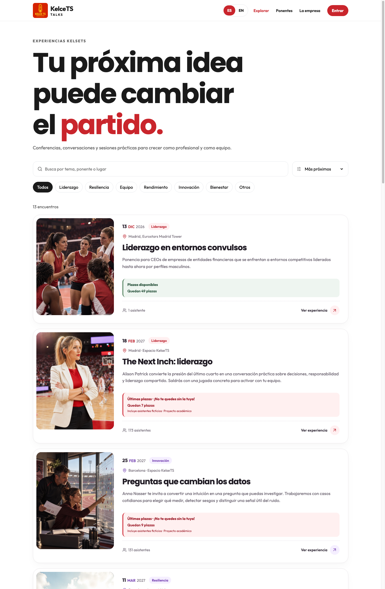

### 12.2. Charla publicada

La ficha pública de «Tu mente y la presión» muestra el cartel cargado, Travis Wood, fecha y hora, ubicación y aforo. La sesión de la creadora permite ver el enlace para editar la experiencia.

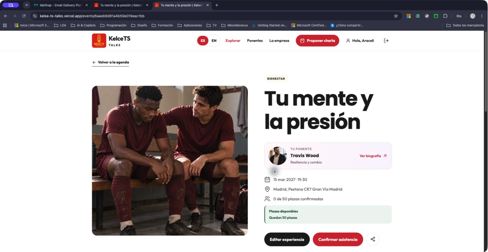

### 12.3. Formulario de edición

El formulario aparece precargado con el título, fecha, hora, lugar, categoría, aforo y ponente. El aviso explica que el cartel se conserva si no se elige otra imagen.

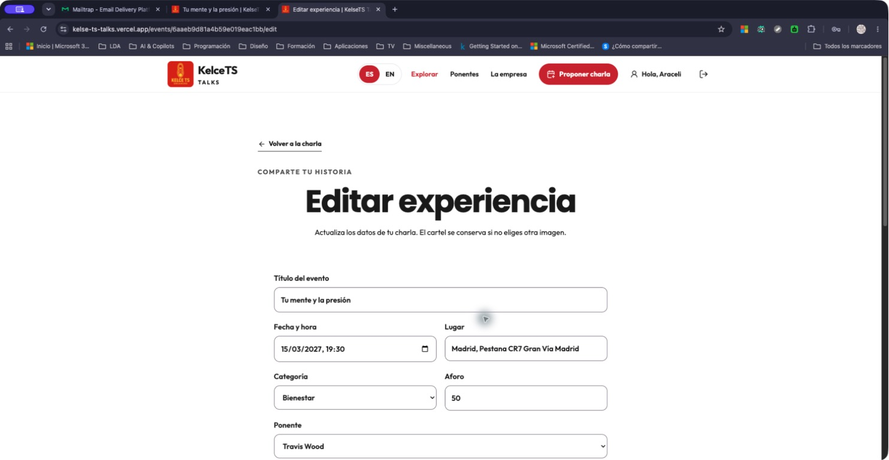

### 12.4. Descripción guardada

La ficha muestra la descripción que comienza «Pedir apoyo también es avanzar», la autoría y el contenido del ponente. Es el estado guardado tras la edición; la captura no muestra el instante del envío del formulario.

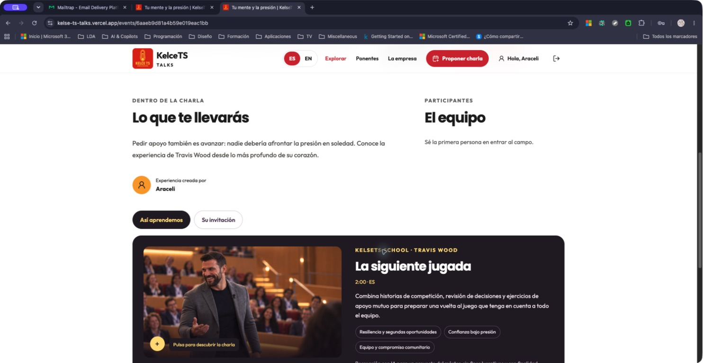

### 12.5. Protección del perfil

La consulta del perfil sin credencial de sesión devuelve 401 y solicita iniciar sesión. La comprobación de Insomnia aparece superada: el rechazo es el resultado esperado.

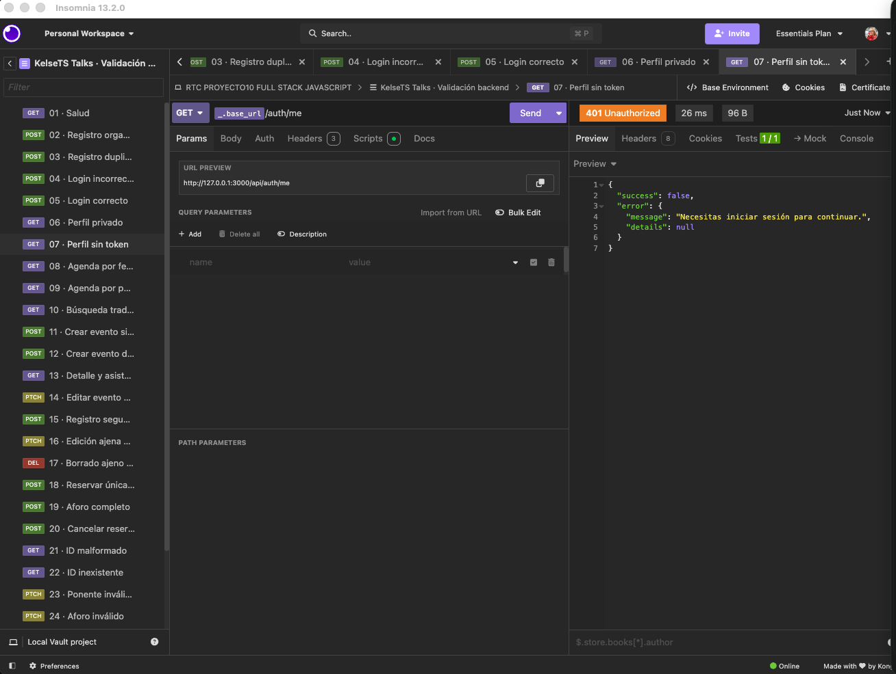

### 12.6. Consulta ordenada de eventos

La petición de agenda con orden por fecha devuelve 200. Se observa el comienzo de la lista y la comprobación superada; la captura no contiene todos los registros de la respuesta.

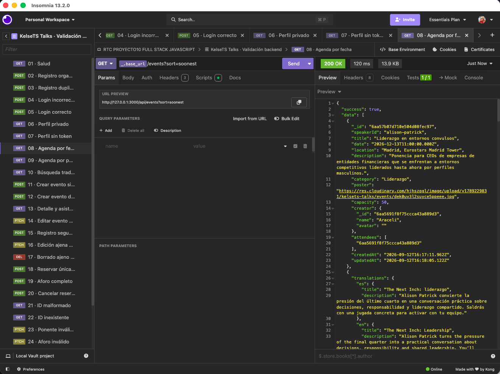

### 12.7. Creación de un evento temporal

La API local devuelve 201 al crear la charla temporal de Insomnia. La respuesta incluye identificador, persona creadora, aforo de una plaza y lista de asistentes vacía.


### 12.8. Edición del evento propio

La modificación devuelve 200 y el título actualizado de la charla temporal. Se conserva el identificador del evento.


### 12.9. Edición ajena denegada

Una segunda cuenta intenta cambiar el evento y recibe 403. La respuesta comunica que solo la persona creadora puede modificarlo en este caso.


### 12.10. Reserva de la única plaza

La reserva devuelve 200 y muestra un asistente para un aforo de una plaza. El estado del correo indica aceptación SMTP en el entorno de pruebas, sin acreditar entrega externa.


### 12.11. Rechazo por aforo completo

La siguiente petición de reserva recibe 409 y el mensaje «El evento ya está completo». La comprobación de ese código aparece superada.


### 12.12. Cancelación de asistencia

La cancelación devuelve 200, el mensaje correspondiente y la lista de asistentes vacía. La plaza del evento temporal queda liberada.

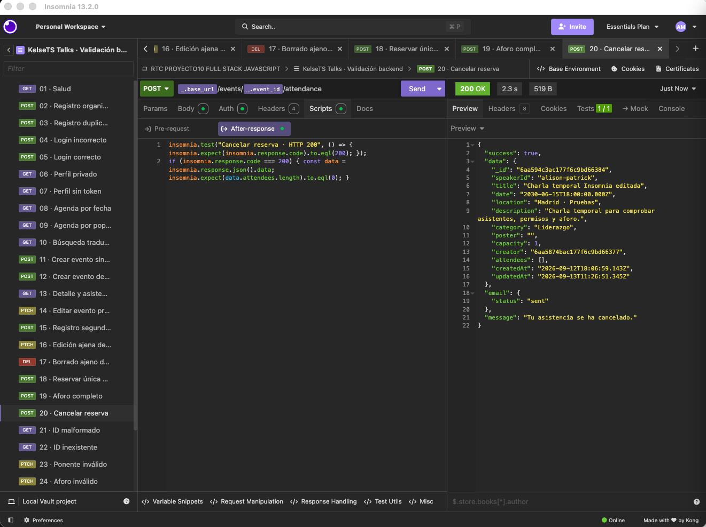

### 12.13. Consulta después de eliminar

La consulta del evento temporal después de su eliminación devuelve 404. Este es el resultado esperado para confirmar que el recurso ya no se encuentra.

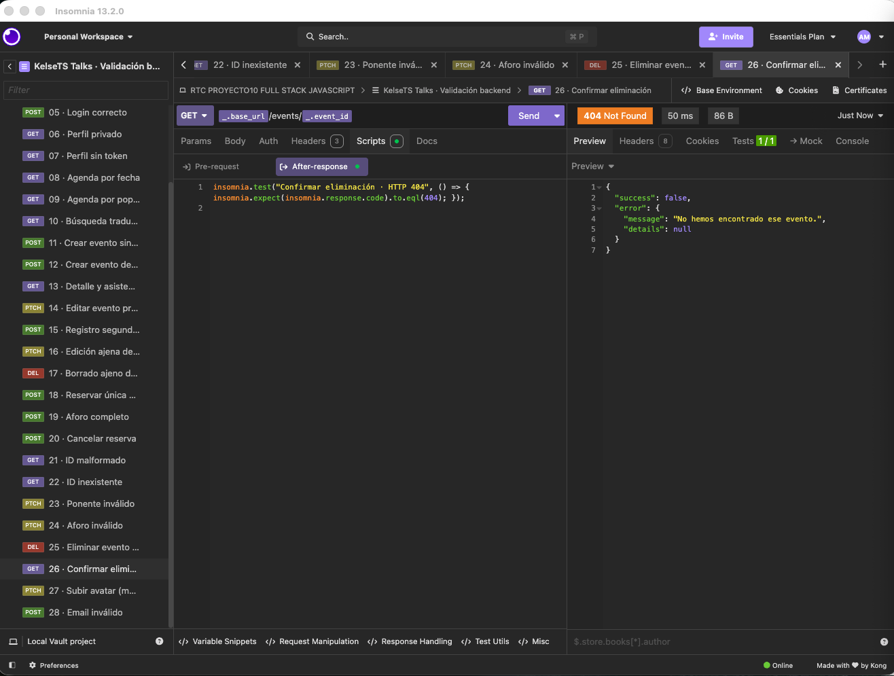

### 12.14. Evento almacenado en Atlas

El filtro por la clave editorial del evento de liderazgo muestra aforo de 180, 173 asistentes y la marca de demostración. La captura permite contrastar estos datos con la agenda de aquella fecha.


### 12.15. Referencias del usuario ficticio

El perfil de demostración muestra su identificador, la marca de usuario ficticio y la lista de referencias a eventos. La contraseña está ocultada en la captura conservada.


### 12.16. Agregación de ocupación

La agregación calcula aforo, confirmadas y libres. Se ven, por ejemplo, 173 plazas confirmadas y siete libres en liderazgo. Es una vista parcial de los resultados, no la lista completa de las doce charlas.


### 12.17. Cartel alojado en Cloudinary

El panel de Cloudinary muestra el cartel de la primera charla creada desde la web, su ubicación, formato JPG, dimensiones y acceso público. El recurso se conserva en el servicio de imágenes.


### 12.18. Correo de confirmación

Mailtrap muestra el mensaje en castellano de «Tu mente y la presión», con el cartel, la fecha, el lugar y el botón de gestión. Es un mensaje recibido en Sandbox.

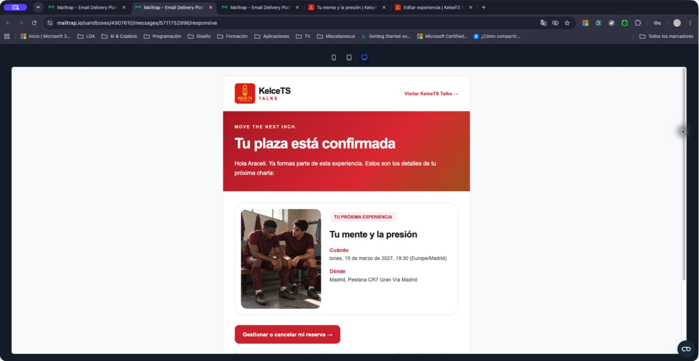

### 12.19. Correo de cancelación

El mensaje de cancelación presenta el estado de la reserva, los datos de la charla y el enlace para volver a su ficha. Corresponde al entorno de pruebas de correo.

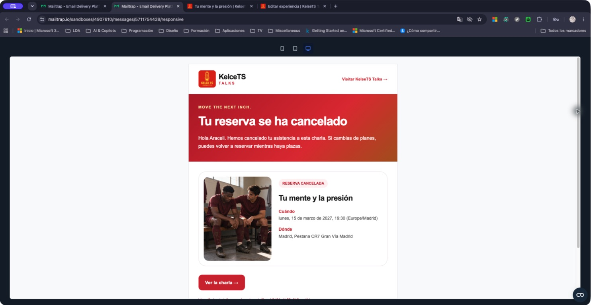

### 12.20. Enlace y pie del correo

La parte inferior del mismo correo muestra el enlace al dominio público y el aviso de plataforma ficticia, pedagógica y sin fines lucrativos.

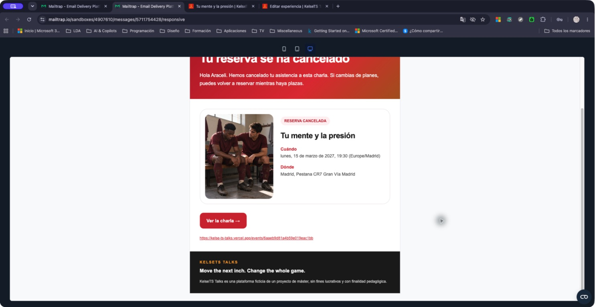

### 12.21. Adaptación del correo a móvil

La vista móvil de una muestra de confirmación presenta cabecera, texto y parte del cartel adaptados al ancho disponible. No muestra el mensaje completo ni acredita compatibilidad con todos los clientes de correo.


### 12.22. Recuperación de acceso

La pantalla publicada ofrece el formulario de recuperación y avisa de que el correo se recibe en Mailtrap Sandbox. No se incluye una imagen del enlace de recuperación porque contiene una credencial temporal.

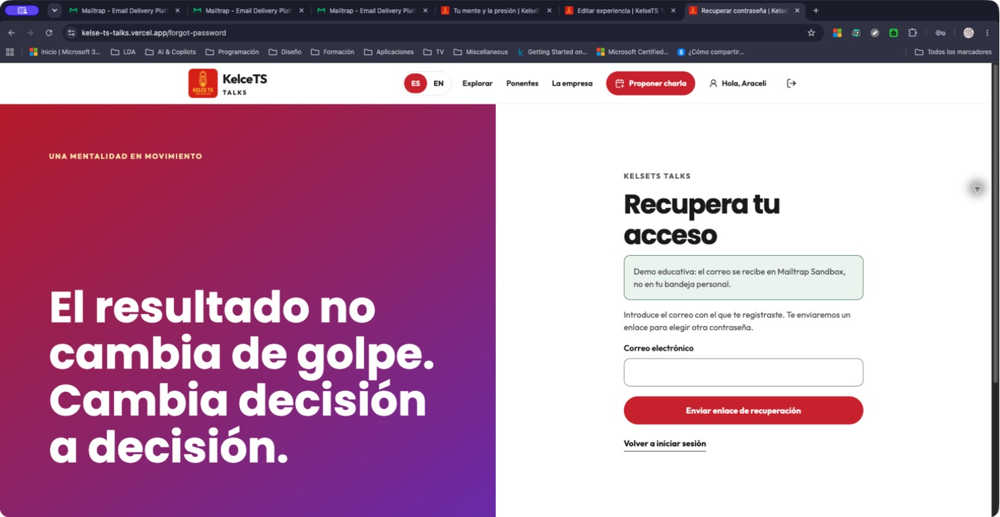

### 12.23. Despliegue de la API

Vercel muestra el servidor en producción con estado preparado, dominio y revisión d549df9. La imagen documenta aquel despliegue; la comprobación funcional de la API corresponde a la ruta /api/health.

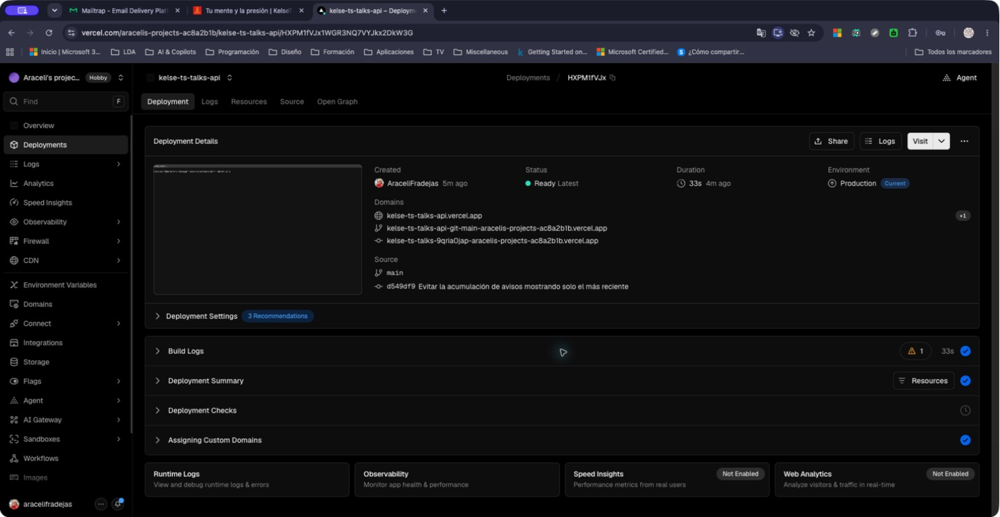

### 12.24. Despliegue de la interfaz

Vercel muestra la interfaz en producción con estado preparado y la misma revisión que la API. La miniatura presenta la portada de la aplicación.

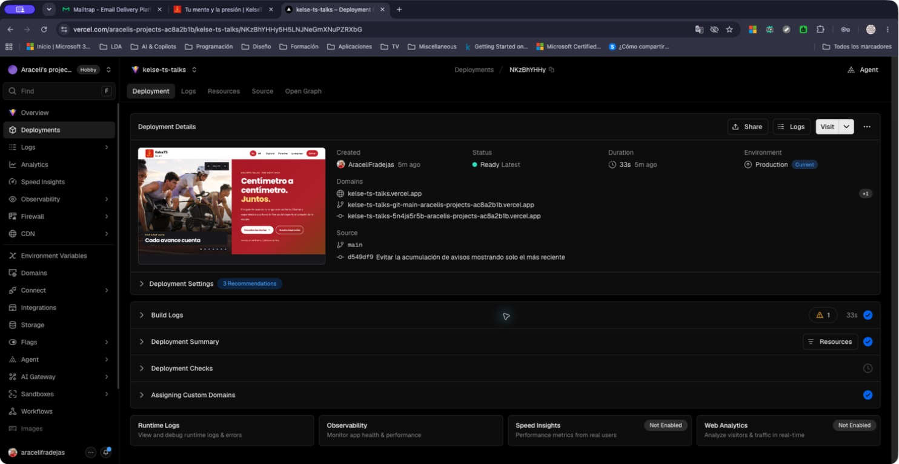

## 13. Dificultades y decisiones

### Mantener coherentes las reservas

Actualizar únicamente la lista de asistentes podía dejar incompleta la relación con el usuario si fallaba la segunda escritura. He utilizado una transacción y control de aforo para que ambas colecciones reflejen la misma operación. El envío de correo queda después de confirmar la reserva.

### Conservar datos durante la edición

El formulario debe mantener el cartel y la fecha si no se cambian. Separé los datos existentes de los campos modificados y añadí comprobación de versión para evitar sobrescribir una edición más reciente. Los eventos pasados pueden conservar su fecha al editarse, pero no admiten nuevas reservas.

### Conexión en el despliegue

La primera publicación devolvió un error de conexión porque Atlas solo admitía la dirección de desarrollo. La configuración de red se adaptó al despliegue de demostración. La aplicación espera ahora a MongoDB antes de procesar las peticiones y comparte la conexión entre solicitudes. La configuración de entrega y sus límites se describen en [Despliegue](docs/DESPLIEGUE.md).

### Imágenes en los correos

Los primeros mensajes mostraban problemas de carga de imágenes. Incorporé el logo y los carteles editoriales al mensaje y comprobé nuevas muestras en Mailtrap. Las evidencias seleccionadas muestran las imágenes cargadas; la vista móvil acredita únicamente la parte visible de ese mensaje.

### Idioma y contenido editorial

La aplicación ofrece castellano e inglés, pero esta memoria está redactada en castellano. El contenido escrito por una persona se conserva en su idioma original; no hay traducción automática. Al editar un título o descripción editorial, el campo modificado sustituye sus versiones antiguas para evitar mostrar información desactualizada.

### Presentación y avisos

Los avisos de acciones sucesivas se acumulaban. El proveedor compartido pasó a mostrar el más reciente, con cierre manual y anuncio accesible. También organicé los estilos conservando su orden y optimicé el logo utilizado en la web y en el correo.

## 14. Qué he aprendido

He aprendido a seguir una operación desde el formulario hasta su persistencia: recoger los datos, validarlos, enviar una petición autenticada, aplicar permisos, escribir en MongoDB y devolver un resultado comprensible a la interfaz.

La relación entre eventos y usuarios me ha permitido practicar referencias y transacciones. La comprobación de la última plaza muestra por qué no basta con leer el aforo y escribir después sin proteger la operación frente a peticiones concurrentes.

También he comprendido que la experiencia de uso depende de los estados intermedios. Indicar que una petición está en curso, conservar el formulario cuando falla y evitar respuestas obsoletas son parte del funcionamiento de la aplicación.

La publicación me ha ayudado a distinguir la configuración local de la del servidor desplegado: conexión a Atlas, variables privadas, CORS, almacenamiento de imágenes y enlaces públicos en los correos.

Finalmente, he aprendido a relacionar cada afirmación con su evidencia. Una respuesta HTTP, una prueba automática, una captura y una comprobación manual aportan información diferente. Documentar su alcance permite revisar el proyecto con mayor precisión.

## 15. Posibles mejoras

- configurar un servicio de correo transaccional y verificar la entrega a buzones reales;
- repetir la colección completa de Insomnia contra la API publicada;
- incorporar gestión de perfil y eliminación de eventos desde la interfaz;
- añadir reintentos y supervisión para los envíos de correo;
- ampliar las comprobaciones en dispositivos y clientes de correo;
- incorporar eventos privados, búsqueda por ciudad y valoraciones posteriores;
- completar los materiales audiovisuales que todavía figuran como próximos;
- estudiar sesiones mediante cookies inaccesibles a JavaScript, con la protección correspondiente.

## 16. Ampliación del proyecto: recuperación de acceso y comunicaciones

Tras completar la gestión de eventos y asistentes, incorporé funciones que permiten practicar procesos habituales de una aplicación con usuarios.

### Objetivos de la ampliación

- solicitar un enlace de recuperación sin revelar si una cuenta existe;
- cambiar la contraseña mediante un enlace temporal de un solo uso;
- invalidar las sesiones anteriores después del cambio;
- comunicar por correo la confirmación y la cancelación de asistencia;
- adaptar la presentación de los mensajes a escritorio y móvil;
- conservar la identidad visual de la web en las comunicaciones.

### Integración con la aplicación

La recuperación utiliza un enlace que caduca a los treinta minutos y cuyo valor se almacena como resumen SHA-256. El cambio guarda la nueva contraseña mediante bcrypt y actualiza la versión de sesión. Los límites de solicitudes se conservan en MongoDB.

Los correos de asistencia incluyen cartel, título, fecha de Madrid, ubicación y enlace público a la ficha. Disponen de HTML y texto alternativo. La reserva se mantiene aunque falle el correo y el enlace nunca cancela una plaza por sí solo.

### Estado

La recuperación y el acceso posterior se comprobaron manualmente en la web publicada el 19/09/2026. Las pruebas de integración cubren uso único y revocación de sesiones. Los mensajes de confirmación y cancelación se recibieron y revisaron en Mailtrap Sandbox.

El envío a buzones personales sigue fuera del alcance verificado. La [guía de recuperación](docs/RECUPERACION-CONTRASENA.md) y la [documentación del correo](docs/CORREO.md) explican el funcionamiento y la configuración necesaria para ampliar ese alcance.

## 17. Conclusión

He completado una aplicación que conecta una interfaz React con una API Express y MongoDB Atlas. Permite descubrir eventos, registrarse, publicar charlas con cartel, editar eventos propios y gestionar la asistencia con control de permisos y aforo.

El proyecto reúne separación de responsabilidades, validación, transacciones, pruebas automáticas y evidencias del uso de la web y de sus servicios. La entrega distingue las funcionalidades comprobadas de las ampliaciones pendientes, especialmente el envío de correo a destinatarios externos.

---

**Araceli Fradejas Muñoz**

Proyecto académico del máster Rock The Code · The Power Tech School.
