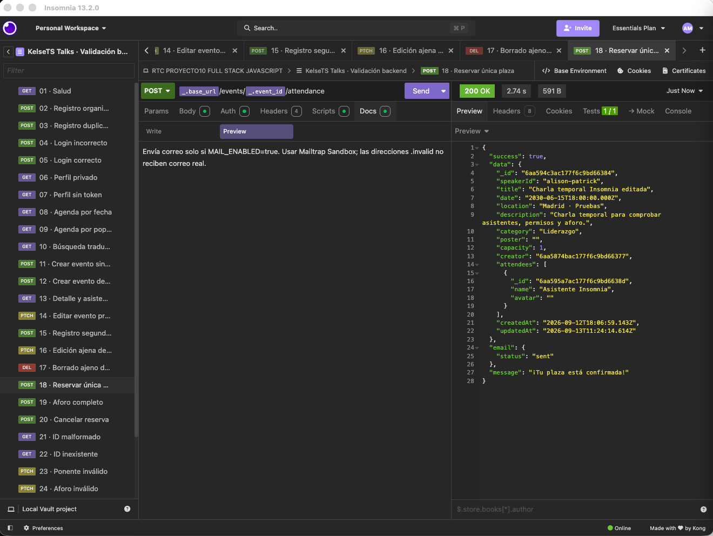
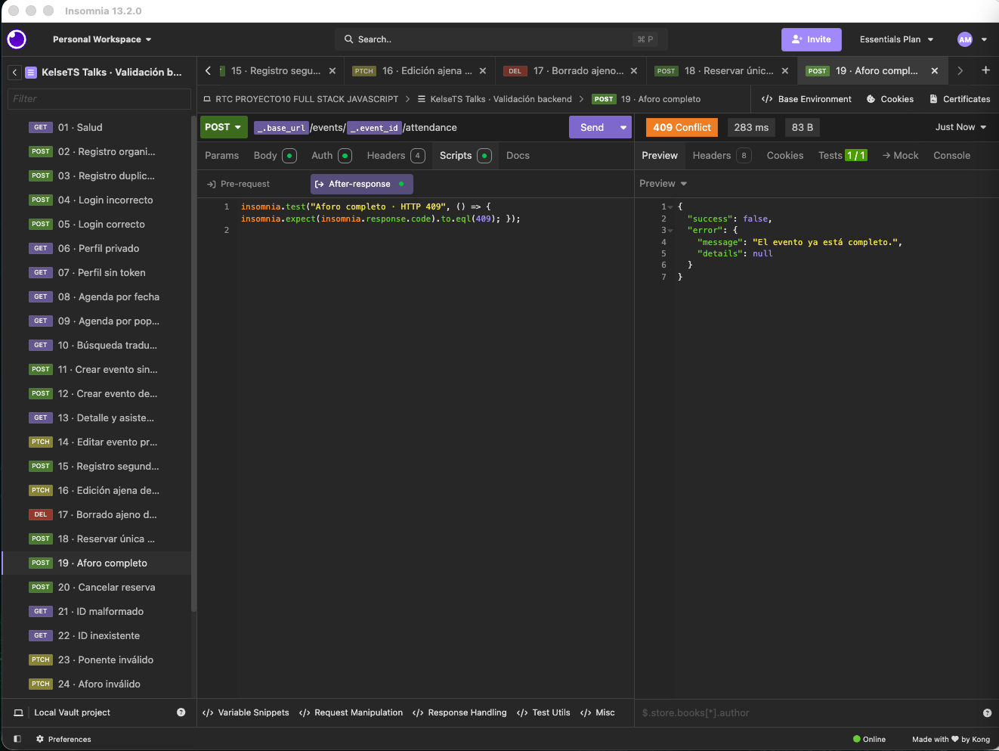
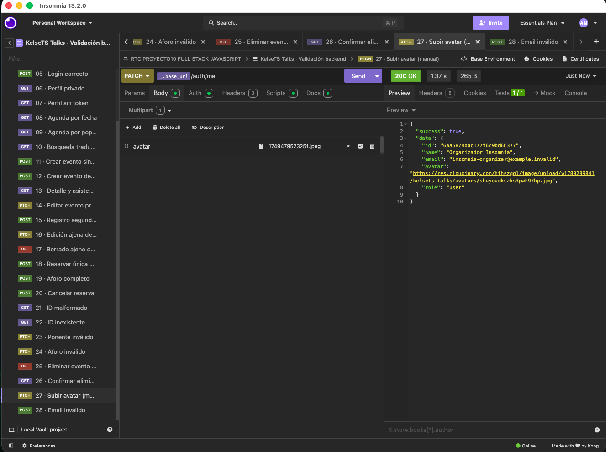

# KelseTS Talks

> **Move the next inch. Change the whole game.**

KelseTS es una empresa ficticia que conecta deporte, cultura, tecnología y desarrollo profesional. **KelseTS Talks** es su plataforma de charlas motivacionales y experiencias de aprendizaje para speakers, líderes, profesionales y equipos.

Este repositorio contiene la plataforma full stack con la que KelseTS publica su agenda, gestiona asistentes y permite que nuevos organizadores creen experiencias.

## Estado actual

Frontend bilingüe ES/EN con 12 charlas (tres por ponente), carteles definitivos y una sección pedagógica de experiencias. Los vídeos se conservan en `production/media/`; la web utiliza imágenes estáticas con enlaces opcionales a YouTube.

La conexión local con MongoDB Atlas está configurada. La agenda se carga desde `backend/src/data/events.json`, con `speakerId`, traducciones ES/EN e identificadores estables `seedKey`. Repetir la carga actualiza el contenido editorial sin duplicar charlas ni sustituir asistentes o creador.

El frontend local ya utiliza la API real. Se han comprobado en navegador el registro, inicio y cierre de sesión, persistencia al recargar, rechazo de contraseña incorrecta, reserva y cancelación de asistencia. La búsqueda consulta también las traducciones ES/EN y admite palabras sin acentos. Cloudinary está conectado y se han comprobado la creación de eventos con cartel y la subida de avatar. El despliegue sigue pendiente. Los secretos se guardan solo en los archivos locales ignorados por Git.

## La empresa

KelseTS traslada al mundo profesional valores del deporte de equipo:

- Resiliencia cuando el marcador va en contra.
- Liderazgo que ayuda a avanzar bajo presión.
- Confianza construida entrenamiento a entrenamiento.
- Talento individual al servicio de un objetivo común.
- Acción concreta frente a la motivación pasajera.

Su narrativa toma como punto de partida el espíritu del discurso del entrenador Tony D'Amato en la película *Any Given Sunday*: el progreso se gana en distancias pequeñas y se consigue en equipo. La aplicación utiliza una identidad y mensajes propios; no reproduce el guion de la película.

## Funcionalidades

- Registro con inicio de sesión automático y login mediante JWT.
- Catálogo de talks con búsqueda, categorías y criterios de ordenación.
- Ficha completa de cada experiencia, aforo y listado de asistentes.
- Directorio de ponentes y biografías bilingües enlazadas desde las charlas asignadas.
- Creación protegida de eventos con subida de carteles.
- Confirmación o cancelación de asistencia en un solo paso.
- Gestión de avatar y permisos de creadora o administradora.
- Estados accesibles de carga, error, éxito y contenido vacío.
- Diseño responsive alineado con la identidad visual de KelseTS.
- Versiones completas de la interfaz en español e inglés con selector ES/EN y preferencia guardada.

## Tecnologías

**Frontend:** React, React Router, Vite, Vitest y CSS.  
**Backend:** Node.js, Express, Mongoose, JSON Web Token, Bcrypt, Multer, Cloudinary y CORS.  
**Base de datos:** MongoDB Atlas.  
**Despliegue:** Vercel.

## Instalación local

Requisitos: Node.js 20 o superior y una base de datos MongoDB.

```bash
git clone https://github.com/AraceliFradejas/RTC-PROYECTO10-FULL-STACK-JAVASCRIPT.git
cd RTC-PROYECTO10-FULL-STACK-JAVASCRIPT
npm install
npm run install:all
cp backend/.env.example backend/.env
cp frontend/.env.example frontend/.env
npm run dev
```

La web estará en `http://localhost:5173` y la API en `http://localhost:3000`.

## Variables de entorno

| Aplicación | Variable | Uso |
| --- | --- | --- |
| Backend | `MONGODB_URI` | Conexión con MongoDB Atlas |
| Backend | `JWT_SECRET` | Firma de tokens de sesión |
| Backend | `FRONTEND_URL` | Orígenes CORS separados por comas |
| Backend | `CLOUDINARY_CLOUD_NAME` | Espacio Cloudinary |
| Backend | `CLOUDINARY_API_KEY` | Identificador de la API de imágenes |
| Backend | `CLOUDINARY_API_SECRET` | Secreto de la API de imágenes |
| Backend | `SEED_PASSWORD` | Contraseña de la cuenta organizadora de demostración |
| Frontend | `VITE_API_URL` | URL pública de la API terminada en `/api` |

## Scripts

```bash
npm run dev      # frontend y backend en paralelo
npm test         # pruebas de ambos proyectos
npm run build    # build de producción del frontend
npm run seed --prefix backend # cargar la agenda de demostración
```

Para cargar las 12 experiencias iniciales, configura `MONGODB_URI` y una contraseña de al menos ocho caracteres en `SEED_PASSWORD`. El proceso puede repetirse sin duplicar los eventos. Para validar el catálogo sin conectar con MongoDB, ejecuta `npm run seed --prefix backend -- --dry-run`. La cuenta organizadora inicial es `talks@kelsets.com`; su contraseña se configura con `SEED_PASSWORD` y no se cambia al repetir la carga.

## Ponentes

Los cuatro perfiles ficticios se definen en `frontend/src/data/speakers.js`, con biografías ES/EN. Cada ponente tiene tres charlas en 2027. MongoDB conserva la relación mediante `speakerId`, que coincide con el identificador de su perfil; la persona organizadora se guarda por separado en `creator`.

### Equipo docente e invitaciones

Alison Patrick forma parte del Comité de Dirección del grupo y es profesora titular de Innovación Empresarial en KelseTS School. Jude enseña Liderazgo e Innovación de Equipos; Anna, Inteligencia Artificial y Estrategia del Dato; y Travis, Resiliencia y Cambio Organizacional. Son cargos del universo ficticio del proyecto.

Las ocho invitaciones ES/EN ya están generadas con las voces aprobadas de ElevenLabs y animación de HeyGen. Los retratos, audios fuente y guiones se conservan en `production/speaker-videos/`; los MP4 públicos se registran en `frontend/src/data/speakerVideos.json`. Las ocho charlas están en `speakerTalks.json`. La web muestra imágenes estáticas y transcripciones; al añadir un enlace de YouTube, la imagen abre el vídeo en otra pestaña.

### Vídeos de ponentes y charlas

Cada biografía (`/speakers/:slug`) y cada evento con ponente asignado incluyen un selector entre la charla y la invitación breve. Los 16 vídeos ES/EN se conservan en `production/media/`, fuera de la compilación del frontend. La web utiliza imágenes estáticas y enlaces externos opcionales. El idioma sigue el selector global de la web.

Los catálogos son `frontend/src/data/speakerVideos.json` y `frontend/src/data/speakerTalks.json`. Los guiones y las fuentes aprobadas se conservan en `production/`; las versiones de prueba se han retirado. El vídeo público de Alison usa la charla ampliada.

## Revisión visual sin backend

Para revisar la agenda y sus 12 fichas en local, crea `frontend/.env.local` con `VITE_PREVIEW_MODE=true` y ejecuta `npm run dev --prefix frontend`. La agenda de muestra permite buscar en el idioma elegido, filtrar categorías y ordenar eventos. No confirma reservas ni escribe datos. Solo se activa durante el desarrollo; la compilación de producción utiliza siempre la API. Para conectar el backend, elimina esta opción o cámbiala a `false`.

## Idiomas

El selector ES/EN cambia el idioma sin recargar la página ni borrar los formularios. Español es el idioma inicial; la selección se guarda en el navegador cuando su almacenamiento está disponible. También se actualizan el atributo `lang`, la descripción de la página, las fechas, los textos accesibles y los avisos.

Los textos están centralizados en `frontend/src/i18n/messages.json`. Las 12 experiencias editoriales tienen versiones en `frontend/src/i18n/events.json` y el catálogo inicial del backend conserva esas mismas traducciones. Los nombres propios se conservan. El contenido nuevo escrito por organizadores se muestra en su idioma original, salvo que el registro aporte `translations.es` o `translations.en`; la agenda inicial ya persiste esas traducciones en MongoDB; su edición desde formularios queda pendiente.

## API

| Método | Ruta | Acceso | Acción |
| --- | --- | --- | --- |
| `POST` | `/api/auth/register` | Público | Crear cuenta y obtener sesión |
| `POST` | `/api/auth/login` | Público | Iniciar sesión |
| `GET/PATCH` | `/api/auth/me` | Privado | Consultar o actualizar perfil |
| `GET` | `/api/events` | Público | Buscar, filtrar y ordenar eventos |
| `GET` | `/api/events/:id` | Público | Consultar detalle y asistentes |
| `POST` | `/api/events` | Privado | Crear evento |
| `PATCH/DELETE` | `/api/events/:id` | Creadora/admin | Editar o eliminar evento |
| `POST` | `/api/events/:id/attendance` | Privado | Alternar asistencia |

## Pruebas del backend con Insomnia

Revisión de 28 capturas reales en local (12–13 de septiembre de 2026): **28 casos con resultado esperado**. La prueba 27 se repitió con una imagen real y devuelve 200 con la URL del avatar en Cloudinary. Su aserción se ha reforzado para exigir esa URL. Los errores de los casos negativos son respuestas esperadas.

- [Colección importable e instrucciones](docs/insomnia/README.md).
- [Memoria: objetivo, petición, resultado e interpretación de cada prueba](MEMORIA.md#validación-detallada-en-insomnia--revisión-del-13-de-septiembre-de-2026).
- [Capturas de Insomnia](docs/screenshots/Insomnia).
- [Guía para completar evidencias de MongoDB, Cloudinary, correo y despliegue](docs/GUIA-CAPTURAS.md).

Creación autenticada: 201 y evento temporal con aforo 1.


Permisos: el segundo usuario recibe 403 al editar un evento ajeno.


Reserva: un asistente y correo aceptado en Mailtrap Sandbox.



Aforo completo: 409 al intentar ocupar una segunda plaza.



Subida multipart de avatar: 200 y URL de Cloudinary.



El Sandbox no entrega mensajes a destinatarios reales. Estas evidencias locales se complementarán con pruebas sobre las URLs públicas antes de entregar.

## Universo KelseTS

| Proyecto | Enfoque | Web |
| --- | --- | --- |
| KelseTS Lifestyle | Movimiento, cultura pop y estilo de vida | [Visitar](https://kelset-slanding.vercel.app/) |
| KelseTS Store | Tienda de zapatillas | [Visitar](https://proyecto-landing-page-2.vercel.app/) |
| KelseTS Business School | IA, innovación y liderazgo | [Visitar](https://kelse-ts-business-school-landing.vercel.app/) |
| KelseTS Talks | Charlas motivacionales y eventos | Próximamente |

## Redes sociales

[GitHub](https://github.com/AraceliFradejas) · [LinkedIn](https://www.linkedin.com/in/araceli-fradejas-munoz-transformaciondigital/) · [X](https://x.com/AraceliFradejas) · [Medium](https://medium.com/@araceli.fradejas) · [YouTube](https://www.youtube.com/@aracelifradejasmunoz2758)

## Aviso legal

KelseTS es una marca ficticia creada por Araceli Fradejas Muñoz con fines exclusivamente educativos, académicos y de portfolio. Este proyecto se inspira creativamente en la cultura pop, la música y el deporte, pero no está afiliado, patrocinado, autorizado ni respaldado por Taylor Swift, Travis Kelce, los Kansas City Chiefs, la National Football League, sus representantes ni ninguna entidad relacionada. Los eventos, productos, speakers, testimonios y servicios mostrados son ficticios.

Los recursos visuales son creaciones originales para este proyecto. Se han seleccionado escenas y equipaciones genéricas, sin emplear fotografías oficiales, escudos de equipos ni imágenes promocionales de celebridades.

## Autora

**Araceli Fradejas Muñoz**

---

# KelseTS Talks · English

> **Move the next inch. Change the whole game.**

KelseTS is a fictional company connecting sport, culture, technology and professional development. **KelseTS Talks** is its platform for motivational talks and sport-inspired learning experiences.

KelseTS translates resilience, leadership, preparation, teamwork and purposeful action into workplace experiences. Its programme **The Next Inch** is inspired by the team-first, incremental-progress spirit of coach Tony D'Amato's speech in *Any Given Sunday*, using entirely original brand language.

The repository includes a React SPA and an Express/MongoDB REST API. Users can sign up, log in, discover talks, publish events, upload artwork and manage attendance. Every asynchronous journey provides clear feedback.

Technical architecture, product decisions, accessibility and deployment are documented in [`MEMORIA.md`](./MEMORIA.md).

## KelseTS universe

[KelseTS Lifestyle](https://kelset-slanding.vercel.app/) · [KelseTS Store](https://proyecto-landing-page-2.vercel.app/) · [KelseTS Business School](https://kelse-ts-business-school-landing.vercel.app/)

## Social profiles

[GitHub](https://github.com/AraceliFradejas) · [LinkedIn](https://www.linkedin.com/in/araceli-fradejas-munoz-transformaciondigital/) · [X](https://x.com/AraceliFradejas) · [Medium](https://medium.com/@araceli.fradejas) · [YouTube](https://www.youtube.com/@aracelifradejasmunoz2758)

## Legal notice

KelseTS is a fictional brand created by Araceli Fradejas Muñoz solely for educational, academic and portfolio purposes. It is creatively inspired by pop culture, music and sport, but is not affiliated with, sponsored, authorised or endorsed by Taylor Swift, Travis Kelce, the Kansas City Chiefs, the National Football League, their representatives or any related organisation. All events, products, speakers, testimonials and services shown are fictional.

## Author

**Araceli Fradejas Muñoz**

### Enlazar los vídeos de YouTube

Añade la URL HTTPS de cada vídeo en el campo `youtubeUrl` del idioma correspondiente en `frontend/src/data/speakerTalks.json` (charlas) o `frontend/src/data/speakerVideos.json` (invitaciones). Mientras esté vacío, la imagen despliega la transcripción; cuando tenga un enlace válido de YouTube, abrirá el vídeo en otra pestaña. No hay reproducción ni conexión a YouTube antes de pulsar.

`production/` conserva los originales y sigue formando parte del repositorio; no se incluye en `frontend/dist`. Los catálogos de archivo en `production/media/` conservan las rutas públicas antiguas como referencia histórica. Los personajes y las charlas siguen siendo ficticios y se mantiene el aviso de su recreación con IA.

### Conoce la experiencia de nuestros alumnos

La portada incluye `LearningStories` después de las fichas originales de los ponentes, en español e inglés. Las cuatro reflexiones y los enlaces de presentación se editan en `frontend/src/data/learningStories.json`. Añadir la URL del montaje a `presentation.es.youtubeUrl` y `presentation.en.youtubeUrl` para cada idioma; mientras falte, se muestra «Próximamente» y se permite explorar los aprendizajes. Los fragmentos y sus posibles enlaces de YouTube se obtienen de `speakerTalks.json`. No hay reproducción ni conexión externa antes de pulsar. El aviso identifica expresamente la recreación pedagógica para el máster.

## Correos de asistencia

La API prepara un correo HTML y una alternativa de texto al confirmar o cancelar asistencia. Usa el idioma enviado por el frontend (ES/EN), el título traducido, el cartel y la fecha en Europe/Madrid. El botón abre la ficha; cancelar requiere iniciar sesión y pulsar el botón de asistencia. Abrir un enlace nunca modifica una reserva.

Generar cuatro vistas locales sin enviar mensajes:

```bash
npm run email:preview --prefix backend
```

Los archivos se guardan en backend/.email-previews/ (ignorado por Git). Sus enlaces son de muestra.

El envío está desactivado por defecto. Para activarlo, configurar SMTP_HOST, SMTP_PORT, SMTP_SECURE, SMTP_USER, SMTP_PASSWORD, MAIL_FROM y PUBLIC_APP_URL en backend/.env. Utilizar un remitente autorizado por el proveedor y una URL pública de la web para que los enlaces y carteles funcionen fuera del ordenador. Activar MAIL_ENABLED=true solo después. Configuración SMTP mediante [Nodemailer](https://nodemailer.com/smtp).

La respuesta de asistencia incluye email.status: disabled, unconfigured, sent o failed. sent indica aceptación del servidor SMTP, no recepción garantizada. Los errores de correo no revierten una reserva y no se reintentan automáticamente; la entrega real a destinatarios externos sigue pendiente. La conexión local a Mailtrap Sandbox ya se ha verificado: confirmación ES y cancelación EN aceptadas y visualización confirmada por la usuaria. Ver [configuración, evidencia y capturas del correo](docs/CORREO.md).
